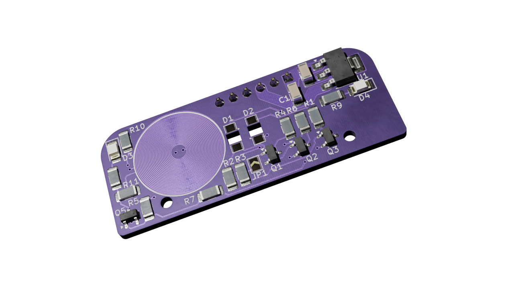

# Optical Adapter for Multical 403

## Table of Contents
1. [Introduction](#introduction)
2. [Features](#features)
3. [Assembly Instructions](#assembly-instructions)
4. [Software](#software)
5. [Usage](#usage)
6. [Troubleshooting](#troubleshooting)

## Introduction

This project provides an optical adapter designed for the Kamstrup Multical 403 heat meter, allowing you to interface with it via serial communication.

**⚠️ WARNING: This project is work in progress and currently untested. Use at your own risk.**

## Features
* On demand activation of the Multical optical interface to reduce power consumption.
* Powered with 5V DC via USB or external power supply.
* Compatible with 3.3V FTDI USB cable.

## Assembly Instructions

### PCB Verification

Before soldering the components, it is recommended to perform the following checks on the PCB to
ensure there are no manufacturing defects:

1. Verify the coil resistance, this can be done by measuring the resistance between the pads
    connected to the coil on the two coil resistors (R10 and R11). The expected resistance should
    be around 18Ω(assuming OSHPark standard 4-layer stackup).

1. Check for short circuits between the 5V, 3V3 and GND pads. 5V and GND is available on the pin
    header while 3V3 is available on the voltage regulator output. There should be no continuity
    between these pads.

### Assembly

1. Solder the components onto the PCB according to the provided BOM and PCB layout. Note that the pin
    header should be soldered on the bottom side of the PCB, while all other components should be
    soldered on the top side. Check out the interactive BOM for component placement and reference
    designators.

    > Tip: Start with the power supply components (voltage regulator, capacitors, and resistors) to
    > ensure the board is powered correctly before soldering the remaining components.

### Mounting

1. Connect a 3.3V FTDI USB cable to the pin header, ensuring the correct orientation. The board is
    designed to be powered by the 5V from the FTDI cable.

1. Mount the optical adapter onto the Multical 403 heat meter's optical interface, the guide holes
    on the PCB should align with the pins on the heat meter. Use double-sided tape on the back of
    the PCB to secure it in place if necessary.

### Bill of Materials

[BOM](https://andreasdahlberg.github.io/multical-403-optical-adapter/bom/optical_adapter-bom.html)

[Interactive BOM](https://andreasdahlberg.github.io/multical-403-optical-adapter/bom/optical_adapter-ibom.html)

## Software

🚧 Work in progress

There is currently no specific software available for interfacing with the optical adapter but
existing tools, such as [PyKMP](https://github.com/gertvdijk/PyKMP) should work. One exception is
the activation of the optical interface, which will require custom code to toggle the activation
pin on the adapter.

## Usage

🚧 Work in progress

## Troubleshooting

🚧 Work in progress

## License

This project is released as **Open Source Hardware** under the [CERN Open Hardware License v2](LICENSE). You are free to use, modify, manufacture, and distribute this hardware, provided you comply with the terms of the license.
